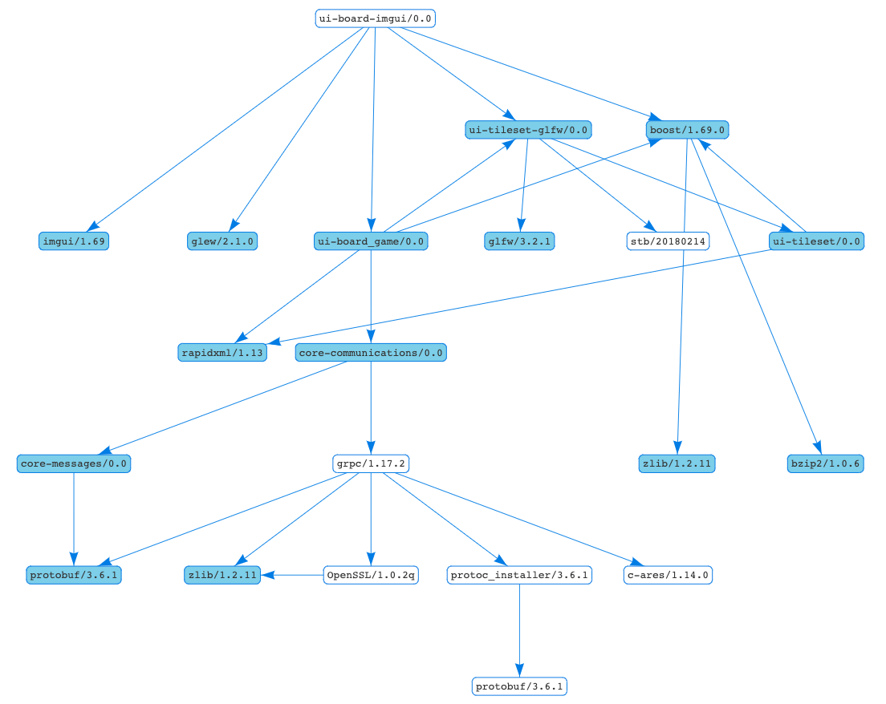

# ui-board-imgui

Executable, it uses ImGUI library to draw a board

```
conan create . sword/sorcery
```

## Dependencies

 * [ui-tileset](https://github.com/sword-and-sorcery/ui-tileset)
 * [ui-tileset-glfw](https://github.com/sword-and-sorcery/ui-tileset-glfw)
 * [core-messages](https://github.com/sword-and-sorcery/core-messages)
 * [core-communications](https://github.com/sword-and-sorcery/core-communications)
 * [ui-board_game](https://github.com/sword-and-sorcery/ui-board_game)



